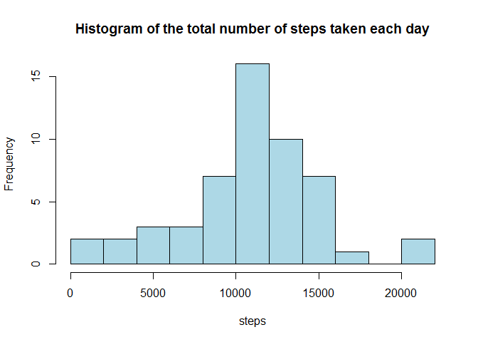
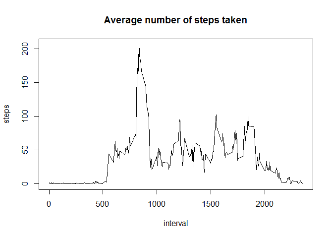
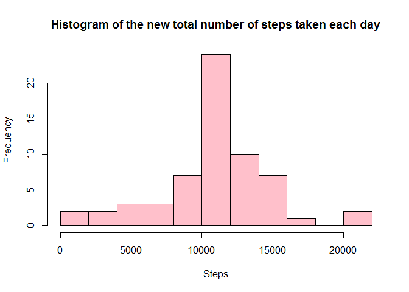
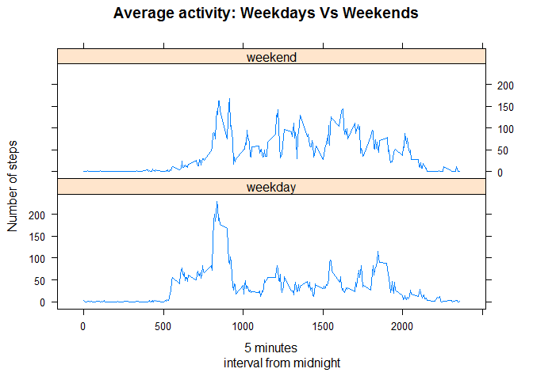

# Reproducible Research: Peer Assessment 1

Reproducible Research: Peer Assessment 1 (SSP)
======================
# Loading and preprocessing the data
Reading the activity.csv file to 'active'.


```r
active <- read.csv("activity.csv")
library(lattice)
```

## What is mean total number of steps taken per day?
Calculating the total number of steps taken per day and saving it in 'tstepsday'

```r
totalstepsday <- aggregate(steps ~ date, data = active, FUN = sum)
```

A histogram of the total number of steps taken each day


```r
hist(totalstepsday$steps, main = "Histogram of the total number of steps taken each day", 
     xlab = "steps", breaks = 10, col = "light blue")
```

 
Calculating the mean and median of the total number of steps taken per day


```r
mean(totalstepsday$steps)
```

```
## [1] 10766.19
```

```r
median(totalstepsday$steps)
```

```
## [1] 10765
```
## What is the average daily activity pattern?
Average daily activity pattern
Making a time series plot (i.e. type = "l") of the 5-minute interval (x-axis) and 
the average number of steps taken, averaged across all days (y-axis)

```r
avgsteps <- aggregate(steps ~ interval, data = active, FUN = "mean")
plot(avgsteps, type = "l", main = "Average number of steps taken")
```

 

Identifying 5-minute interval that contains the maximum number of steps

```r
avgsteps$interval[which.max(avgsteps$steps)]
```

```
## [1] 835
```
## Imputing missing values
Calculating the total number of missing values in the dataset in steps, date and interval

```r
sum(is.na(active$steps))
```

```
## [1] 2304
```

```r
sum(is.na(active$date))
```

```
## [1] 0
```

```r
sum(is.na(active$interval))
```

```
## [1] 0
```
Filling in all of the missing values in the dataset
The missing values will be filled up with the averaged steps per interval.
These averaged number of steps are available in 'avgsteps'.

```r
newactive <- merge(active, avgsteps, by = "interval", suffixes = c("", ".y"))
nas <- is.na(newactive$steps)
newactive$steps[nas] <- newactive$steps.y[nas]
newactive <- newactive[, c(2,3,1)]
```
check if all the missing values have been replaced

```r
sum(is.na(newactive))
```

```
## [1] 0
```

```r
sum(is.na(active))
```

```
## [1] 2304
```
Make a histogram of the total number of steps taken each day 

```r
newtotalstepsday <- aggregate(steps ~ date, data = newactive, FUN = sum)
hist(newtotalstepsday$steps, main = "Histogram of the new total number of steps taken each day",
     breaks = 10, col = "pink", xlab = "Steps" )
```

 
Calculate and report the mean and median total number of steps taken per day. 

```r
mean(newtotalstepsday$steps)
```

```
## [1] 10766.19
```

```r
median(newtotalstepsday$steps)
```

```
## [1] 10766.19
```
Plotting a timeseries 

```r
newavgsteps <- aggregate(steps ~ interval, data = newactive, FUN = "mean")
plot(newavgsteps, type = "l", main = "New Average steps after replacing the missing values" )
```

 
Identifying 5-minute interval that contains the maximum number of steps

```r
newavgsteps$interval[which.max(newavgsteps$steps)]
```

```
## [1] 835
```
Do these values differ from the estimates from the first part of the assignment? 
What is the impact of imputing missing data on the estimates of the total daily number of steps?

Filling up the missing values has not changed the shape of the histogram. 
The mean and the median too have not changed much. 
However the impact of imputing mising data has increased the total number of steps per day.

## Are there differences in activity patterns between weekdays and weekends?
Creating a new factor variable in the dataset with two levels - "weekday" and "weekend" ndicating whether a given date is a weekday or weekend day.

```r
newactive$day <- "weekday"
newactive$day[weekdays(as.Date(newactive$date), abb = T) %in% c("Sat", "Sun")] <- "weekend"
```
# Examining the data

```r
table(newactive$day)
```

```
## 
## weekday weekend 
##   12960    4608
```
Make a panel plot containing a time series plot (i.e. type = "l") of the 5-minute interval (x-axis) and the average number of steps taken, averaged across all weekday days or weekend days (y-axis).

```r
newavgstepsdays <- aggregate(steps ~ interval + day, data = newactive, FUN = "mean")
xyplot(steps ~ interval|day, data = newavgstepsdays, type = "l", layout = c(1,2), xlab = "5 minutes
       interval from midnight", ylab = "Number of steps", 
       main = "Average activity: Weekdays Vs Weekends")
```

 

